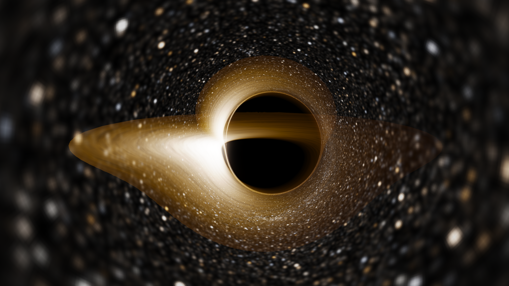

# Neural Geodesics



> **Trazado de rayos alrededor de agujeros negros (Schwarzschild y Kerr), acelerado con redes neuronales que resuelven la ecuación geodésica en vez de interpolar imágenes.**

El proyecto tiene dos mitades que comparten una misma idea: en vez de integrar la ecuación de la geodésica rayo a rayo con un método numérico clásico (caro, y más aún con espín), se entrena una red que **aprende la solución de esa ecuación diferencial** — no el mapa final píxel→imagen — y se usa esa red para renderizar en tiempo real.

- **Schwarzschild** (sin espín): la red aprende `u(φ)`, la órbita del fotón, con **MAE 4.3e-5** y **51× más rápida** que RK45. Aquí el integrador clásico sí es el cuello de botella, y la red lo sustituye.
- **Kerr** (con espín): renderer clásico por fuerza bruta validado a 1e-8, y un renderer nuevo en **tiempo de Mino** que reproduce el trazado exacto a **0.001 px** con **5-6× de speedup** y la sombra idéntica píxel a píxel.

> **Hallazgo del proyecto**: en tiempo de Mino las geodésicas de Kerr resultan ser *analíticamente resolubles*, así que para Kerr la red **no hace falta** para la precisión — el camino exacto es 3500× más preciso al mismo coste. Se documenta en [docs/mino.md](docs/mino.md), junto con los resultados negativos y los bugs que costaron tiempo.

## Por qué existe este enfoque

Un trazador de rayos clásico integra una EDO por cada píxel de la imagen. Es exacto pero caro, y en Kerr el coste se dispara porque el movimiento deja de ser plano (ya no depende solo de un parámetro de impacto `b`, como en Schwarzschild, sino de dos constantes de movimiento). La primera versión del surrogate de Kerr intentó atajar esto entrenando una red que fuera directo de "píxel de cámara" a "salida del renderer" (dirección de escape, cruce con el disco). Funcionaba mal cerca del anillo de fotones — ahí el mapa píxel→salida es caótico — y necesitaba parches (una cabeza de red solo para decidir "¿existe el cruce?").

La corrección: en **tiempo de Mino** (`dλ = dτ/Σ`) las ecuaciones de Kerr para `r` y `θ` se desacoplan por completo, cada una en una EDO de una sola variable. Eso es justo lo que hace tratable a Schwarzschild — ahí la red aprende `u(φ)` directamente, sin pasar por la cámara. En Kerr se puede hacer lo mismo: dos redes pequeñas (`Net_r`, `Net_θ`) que resuelven esas EDO, más álgebra exacta (raíces de un polinomio, integrales elípticas) para todo lo que sí tiene forma cerrada — clasificación de la sombra, fases, cruces con el disco. El caos del anillo de fotones queda en la aritmética de fase, que es exacta, no dentro de la red.

## Instalación

Requiere Python ≥ 3.10. GPU con CUDA opcional pero recomendada para entrenar (el proyecto usa una RTX 3050 de 4 GB).

```bash
git clone https://github.com/mmmaxii/neural-geodesics.git
cd neural-geodesics
pip install -e .
```

Dependencias opcionales:
```bash
pip install -e ".[dev]"        # pytest, black, ruff, isort
pip install -e ".[notebook]"   # jupyter, ipywidgets
```

## Uso básico

### Schwarzschild (completo)
```bash
# generar el dataset de entrenamiento (geodésicas por RK45/Binet)
python scripts/generate_data.py

# entrenar la red que aprende u(phi)
python scripts/train_model.py

# renderizar con el integrador clásico
python scripts/render_classical.py --spin 0.0 -W 960 -H 540
```

### Kerr — renderer clásico (completo y validado)
```bash
# render por fuerza bruta, un rayo por pixel, contra el cielo real de Gaia
python scripts/render_kerr.py --spin 0.9 --inc 85 -W 960 -H 540

# comparar espines uno al lado del otro
python scripts/render_kerr.py --compare-spin 0.0 0.9 0.998

# superponer la sombra analítica sobre el render, para validar visualmente
python scripts/render_kerr.py --spin 0.998 --outline
```

### Kerr — surrogate neuronal (baseline anterior, funcional pero con las limitaciones descritas arriba)
```bash
python scripts/generate_kerr_data.py
python scripts/train_kerr_model.py
python scripts/render_neural.py --compare   # error medido: ~13 px vs el clásico
python scripts/visor_neural.py              # visor interactivo en vivo
```

### Kerr — tiempo de Mino (el camino actual)
```bash
# validar la capa física exacta contra el integrador hamiltoniano (6 tests)
python scripts/validate_kerr_mino.py --etapa 0

# renderizar, y comparar contra el trazador clásico midiendo el error en PÍXELES
python scripts/render_kerr_mino.py --spin 0.9 --inc 85 --mu-exacto --compare

# sin --mu-exacto usa la red para cos(theta): más rápido de evaluar, menos preciso
python scripts/render_kerr_mino.py --spin 0.9 --inc 85 --compare
```

Para regenerar los datasets y reentrenar las redes:
```bash
python scripts/generate_kerr_mino_data.py --etapa ambos -j 10
python scripts/train_kerr_mino.py --etapa ambos
```

## Estructura del proyecto

```text
neural-geodesics/
├── src/
│   ├── physics/       # métricas, integradores, y la capa de tiempo de Mino
│   ├── models/         # redes neuronales (Schwarzschild, Kerr clásico, Kerr-Mino)
│   └── rendering/       # utilidades de imagen, motor de render en vivo
├── scripts/            # generación de datos, entrenamiento, render, validación
├── data/{raw,processed}/
├── models/checkpoints*/
├── results/{figures,benchmarks}/
├── notebooks/           # exploración interactiva
├── docs/                # notas técnicas de cada etapa (desvio.md, mapa.md)
└── tests/
```

## Estado actual

| Pieza | Estado |
|---|---|
| Integrador de Schwarzschild (ecuación de Binet) | ✅ Validado |
| Red neuronal de Schwarzschild (`u(φ)`) | ✅ MAE 4.3e-5, 51× más rápida que RK45 |
| Métrica y integrador hamiltoniano de Kerr | ✅ Validado a 1e-8 (sombra, Hamiltoniano, reducción a a=0) |
| Renderer clásico de Kerr (fuerza bruta, CPU y GPU) | ✅ Completo, con disco y cielo de Gaia |
| Surrogate neuronal de Kerr — enfoque anterior (imagen→imagen) | ⚠️ Funcional, conservado como baseline; ~13 px de error, falla cerca del anillo de fotones |
| Capa analítica de tiempo de Mino (raíces, sombra exacta, integrales elípticas) | ✅ Validada contra el integrador hamiltoniano: dirección de escape 3e-8 rad, θ final 2e-9 rad |
| Datasets en tiempo de Mino (50k tracks polares + 159k radiales) | ✅ Generados |
| Redes `Net_r` y `Net_θ` + entrenamiento | ✅ Entrenadas (`Net_r`: MAE 1.5e-4) |
| Renderer de Kerr en tiempo de Mino con `--compare` | ✅ **0.001 px de error, sombra 100% idéntica, 5-6× speedup** |

### Precisión medida del renderer de Kerr en tiempo de Mino

Contra el trazador clásico, malla de 160×90, sobre `a ∈ {0, 0.5, 0.9, 0.998}` × `inc ∈ {30°, 60°, 85°}`:

| Métrica | Resultado |
|---|---|
| Clasificación de la sombra | 100% de píxeles idénticos (sale en forma cerrada, no de una red) |
| Dirección de escape | 0.001 px de media, 0.000 px de mediana |
| Speedup | 5.1× – 6.1× |

Para comparar: el surrogate anterior (imagen→imagen) se quedaba en ~13 px y fallaba justo en el anillo de fotones.

El objetivo de la etapa en curso: igualar en Kerr lo que ya se logró en Schwarzschild — una red que resuelve la ecuación diferencial en vez de interpolar renders, validada punto a punto contra el integrador, con error final por debajo de ~1-2 píxeles.

## Referencias
- Raissi et al. (2019) — Physics-informed neural networks.
- Bardeen (1973) — Timelike and null geodesics in the Kerr metric.
- Gralla & Lupsasca (2020) — Null geodesics of the Kerr exterior.
- arXiv:2507.15775 — GravLensX: Neural rendering of gravitational lensing.

## Licencia
MIT License

**Autor:** Maximiliano Valderrama
