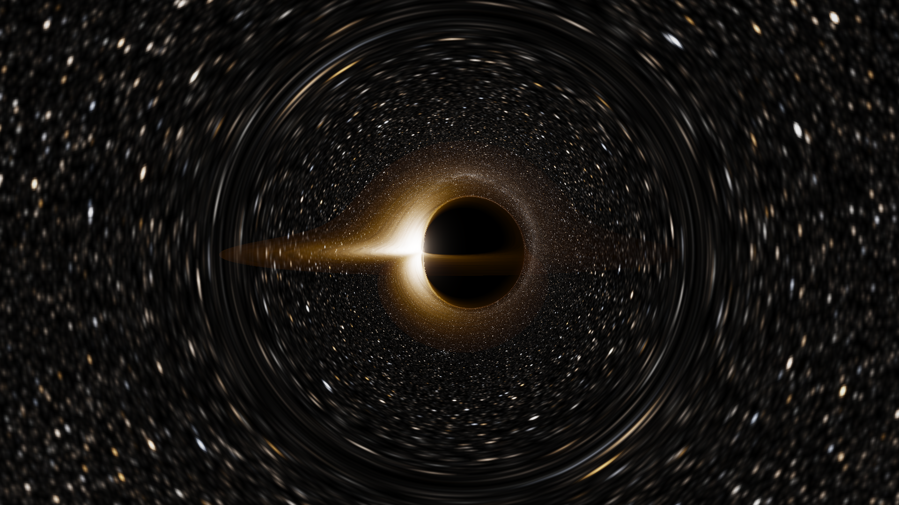
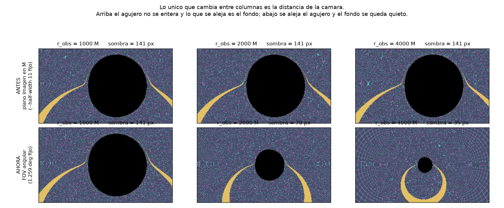

# Neural Geodesics



> **Relativistic ray tracing around black holes (Schwarzschild and Kerr), with neural networks that learn the *solution of the geodesic equation* rather than interpolating rendered images.**

Two halves that share one idea. Instead of integrating the geodesic ODE ray by ray with a classical solver, train a network on the solution of that differential equation and use it to render. The Schwarzschild half does exactly that and works. The Kerr half was built to do the same — and produced a more interesting result than the one it was aiming for.

| | Result |
|---|---|
| **Schwarzschild** — network learns the photon orbit `u(φ)` | **MAE 4.3e-5**, **51× faster than RK45**, 8.8k parameters. The classical integrator really is the bottleneck here, and the network replaces it. |
| **Kerr** — surrogate in Mino time | Reproduces the classical tracer to **0.001 px**, shadow classification **100% identical**, **3–8× speedup** (11–17× against a high-precision reference). |
| **The finding** | In Mino time, Kerr null geodesics turn out to be **analytically solvable**. The network is not needed — and, measured, does not help. |

---

## The main finding, stated honestly

This project set out to show that a neural network can accelerate relativistic ray tracing. For Schwarzschild it does. For Kerr, chasing accuracy revealed something better than the network:

In **Mino time** (`dλ = dτ/Σ`) the Kerr equations for `r` and `θ` decouple *exactly*. The trajectory then depends only on `(ξ, η, a)` — the camera disappears from the problem. From there:

- `θ(λ) = √u₊ · sn(K(m)(1−4x), m)` — exact closed form (Jacobi `sn`).
- `φ` splits into two quadratures: polar (elliptic integral of the third kind, Carlson `R_J`) and radial (Gauss–Legendre in a well-chosen variable).
- `r(λ)` has no elementary closed form, but inverting `λ(r)` with a few Newton steps on Carlson `R_F` reaches machine precision.

Every single time a network output was replaced by its closed form, the error dropped an order of magnitude: **32 px → 1.1 px** (exact `Φ_r`) **→ 0.001 px** (exact `μ`). The fully exact path is **3500× more accurate at identical cost**.

Then the speed claim was tested too, and it did not survive either — see [the ablation](#3-does-the-network-earn-its-place-no) below. **The 3–8× speedup comes from the Mino formulation, not from the network.**

This is a stronger and more defensible claim than "the network is the only way", and it is the kind of result that is usually not published. The negative results and the bugs that cost the most time are written up in [docs/mino.md](docs/mino.md).

---

## Why the approach looks the way it does

A classical ray tracer integrates one ODE per pixel. Exact, but expensive — and in Kerr the cost climbs because the motion is no longer planar: it depends on two constants of motion rather than a single impact parameter `b`.

The first Kerr surrogate tried to shortcut this by learning *camera pixel → renderer output* directly. It stalled at **~13 px** and failed exactly at the photon ring, where that map is chaotic, and it needed a patch head just to answer "does the disk crossing exist?". It was interpolating renders, not solving an ODE.

The fix was to change coordinates, not to grow the network. In Mino time the chaos near the photon ring becomes **phase arithmetic**, which is exact: a ray that winds twenty times costs the network exactly as much as one that does not wind at all. The chaos is kept *outside* the network. That single idea is what took the error from 13 px to 0.001 px.

---

## Installation

Python ≥ 3.10. A CUDA GPU is optional but recommended for training (developed on an RTX 3050 Laptop, 4 GB).

```bash
git clone https://github.com/mmmaxii/neural-geodesics.git
cd neural-geodesics
pip install -e .
```

Optional extras:
```bash
pip install -e ".[dev]"        # pytest, black, ruff, isort
pip install -e ".[notebook]"   # jupyter, ipywidgets
```

---

## Usage

### Schwarzschild — the complete pipeline

```bash
python scripts/generate_data.py                       # dataset from RK45 on the Binet equation
python scripts/train_model.py                         # train the network that learns u(phi)
python scripts/render_classical.py --spin 0.0 -W 960 -H 540
python scripts/render_neural.py                       # same renderer, network instead of RK45
python scripts/visor_neural.py                        # live interactive viewer
```

### Kerr — classical tracer (the reference everything is measured against)

```bash
python scripts/render_kerr.py --spin 0.9 --inc 85 -W 960 -H 540
python scripts/render_kerr.py --compare-spin 0.0 0.9 0.998
python scripts/render_kerr.py --spin 0.998 --outline   # analytic shadow overlaid on the render
```

### Kerr — the Mino-time engine

```bash
# validate the exact physics layer against the Hamiltonian integrator (6 blocking tests)
python scripts/validate_kerr_mino.py --etapa 0

# validate the camera against closed forms of the metric (8 tests)
python scripts/validate_kerr_camera.py

# render, and measure the error against the classical tracer in PIXELS
python scripts/render_kerr_mino.py --spin 0.9 --inc 85 --mu-exacto --compare

# coordinate-grid background: the fastest way to see whether the lensing map is right
python scripts/render_kerr_mino.py --spin 0 --grid --no-disk --fov-deg 60 --r-obs 20

# live viewer with a per-stage timing breakdown
python scripts/visor_kerr_mino.py --grid
```

Benchmarks:
```bash
python scripts/benchmark_kerr_mino.py              # throughput vs the classical tracer
python scripts/benchmark_kerr_mino.py --ablacion   # does the network earn its place?
```

Regenerating datasets and retraining:
```bash
python scripts/generate_kerr_mino_data.py --etapa ambos -j 10
python scripts/train_kerr_mino.py --etapa ambos
```

---

## Project structure

```text
neural-geodesics/
├── src/
│   ├── physics/        # metrics, integrators, the Mino-time layer, the camera
│   ├── models/         # networks (Schwarzschild, Kerr image→image, Kerr-Mino)
│   └── rendering/      # render engines, sky/disk shading
├── scripts/            # data generation, training, rendering, validation, benchmarks
├── data/{raw,processed}/
├── models/checkpoints*/
├── results/{figures,benchmarks}/
├── notebooks/
├── docs/               # technical notes per stage (mapa.md, mino.md, desvio.md)
└── tests/
```

---

## Status

| Component | Status |
|---|---|
| Schwarzschild integrator (Binet equation) | ✅ Validated against Christoffel integration to 1e-11 |
| Schwarzschild network (`u(φ)`) | ✅ MAE 4.3e-5, 51× faster than RK45 |
| Schwarzschild neural renderer + live viewer | ✅ Complete — this was the project's original goal |
| Kerr metric and Hamiltonian integrator | ✅ Validated to 1e-8 (shadow, Hamiltonian, reduction to a=0) |
| Kerr classical renderer (CPU and GPU) | ✅ Complete, with accretion disk and real Gaia sky |
| Kerr image→image surrogate | ⚠️ Kept as a baseline; ~13 px, fails at the photon ring |
| Mino-time analytic layer | ✅ Escape direction 3e-8 rad, final θ 2e-9 rad vs the Hamiltonian integrator |
| Kerr Mino-time renderer | ✅ **0.001 px, shadow 100% identical, 3–8× speedup** |
| Angular camera with ZAMO tetrad | ✅ Shadow angular radius exact to 1.1e-16 rad |
| `KerrRNet` in the render path | ❌ **Removed** — measured to cost accuracy and time (see below) |

---

## Benchmarks

All numbers measured on an RTX 3050 Laptop GPU, `a = 0.9`, `inc = 85°`, unless stated otherwise.

### 1. Accuracy against the classical tracer

160×90 grid, over `a ∈ {0, 0.5, 0.9, 0.998}` × `inc ∈ {30°, 60°, 85°}`:

| Metric | Result |
|---|---|
| Shadow classification | **100% identical pixels** (closed form from the quartic roots, not a network) |
| Escape direction | **0.001 px** mean, 0.000 px median |
| Disk crossing radius \|Δr\| | 2.1e-12 M median |

The previous image→image surrogate stalled at ~13 px on the same comparison.

### 2. Throughput

The classical tracer is timed at two tolerances, because the honest speedup depends on which one you compare against: `rtol 1e-6` is a "preview" render, `rtol 1e-10` is what is used as an accuracy reference.

| Resolution | Rays | Precompute | Geometry | **Total** | ms/ray | vs classical 1e-6 | vs classical 1e-10 |
|---|---|---|---|---|---|---|---|
| 160×90 | 14 400 | 0.09 s | 0.48 s | **0.56 s** | 0.039 | **3.2×** | **11.0×** |
| 480×270 | 129 600 | 0.83 s | 4.56 s | **5.40 s** | 0.042 | **5.1×** | **17.5×** |
| 960×540 | 518 400 | 3.40 s | 17.55 s | **20.94 s** | 0.040 | **7.8×** | — |

Cost per ray is flat (~0.04 ms), so the **speedup grows with resolution**: the classical tracer gets more expensive per ray as more pixels land near the photon ring, where rays wind many times. That is precisely the regime that costs nothing here, because the winding is exact phase arithmetic.

### 3. Does the network earn its place? No.

**Network vs closed form**, same scene, same precompute:

| Resolution | Geometry (network) | Geometry (closed form) | Frame ratio |
|---|---|---|---|
| 160×90 | 0.48 s | 0.46 s | **0.97×** |
| 480×270 | 4.56 s | 4.48 s | **0.99×** |
| 960×540 | 17.55 s | 17.22 s | **0.98×** |

The network is equal or marginally slower. The reason is structural: switching `μ(x)` from Jacobi `sn` to the network changes only the polar part; everything else (`refinar_r`, `integral_phi_r`, `G_phi_exacto`) runs on SciPy special functions on CPU in **both** modes.

**The `KerrRNet` ablation** (`--ablacion`), over 170k disk crossings and three spin/inclination configurations. The network's only remaining job was to seed a Newton iteration; the alternative is a crude analytic seed using the two closed-form endpoints of `r(λ)`:

| Seed | Iterations | \|Δr\| p99 | \|Δr\| **worst** | non-finite crossings |
|---|---|---|---|---|
| **analytic** | 4 | 3.0e-13 | **4.7e-08 M** | **0** |
| `KerrRNet` | 6 | 5.0e-13 | **3.1e+01 M** | **67** |
| `KerrRNet`, no Newton | 0 | 4.9e+00 | 3.3e+03 M | — |

At equal **worst-case** accuracy the network costs **+37% to +72%** more time. At equal p99 the two look identical (±5%) — the p99 hides the damage, because it is concentrated in a handful of rays. *Measure the worst case, not the percentile.*

The network seed also turned out to be the cause of a silent bug: it errs by up to 3.3e3 M on its worst ray, Newton then falls below a real root, takes the square root of a negative number and returns `nan`, which the disk mask silently discarded. With the analytic seed there are **zero** such crossings.

`KerrRNet` is therefore no longer in the render path. It is kept behind a flag so the ablation stays reproducible.

### 4. Camera validation

The image plane originally used Bardeen celestial coordinates `(α, β)` in units of M — impact parameters, not angles. Since the shadow spans ~5 M in those coordinates regardless of distance, moving the camera left the shadow at a **constant pixel size** (measured: 113.13 px at r_obs = 250, 500, 1000, 2000 and 4000 M — variation 0.0000%) while the background scale changed. The render said the hole was nailed in place and the sky was receding.



The fix is a real angular field of view with the observer's **ZAMO orthonormal tetrad** (`src/physics/kerr_camera.py`). With `a = 0` it reduces exactly to `b = r sin ψ / √(1 − 2M/r)`, the already-validated relation in the Schwarzschild renderer.

Validated against closed forms of the metric — *not* against the tracer, which shares the `(α, β)` convention and would agree with a wrong-but-consistent camera:

| Test | Result |
|---|---|
| Tetrad orthonormality, \|EᵀgE − η\| | 4.4e-16 |
| a=0 limit vs the Schwarzschild relation | 3.4e-16 relative |
| Round trip (α,β) → ξ, η **and p_r** | ≤ 6.6e-16 |
| **Shadow angular radius vs `sin ψ = 3√3 √(1−2M/r)/r`**, r_obs = 5…1000 M | **1.1e-16 rad** |
| Weak-field deflection vs `4M/b + (15π/4)(M/b)²` | 1.2e-4 relative at b = 300 M |
| Capture edge vs the Bardeen shadow outline | 7.2e-4 M |

A second bug surfaced while fixing this: the escape radius was tied to camera distance (`1.05 · r_obs`), which is exactly what it must not be. Measured against the tracer at rtol 1e-12 with the camera at 30 M, that biased the escape direction by up to **2.5 px**; at `10 · r_obs` it drops to 0.004 px.

---

## Honest notes

- **The premise that motivates neural geodesic solvers does not hold in this repository.** The usual argument is that evaluating Christoffel symbols and `dt/dλ` at every step is the bottleneck. Here `SMetric.christoffel_symbols()` is never called from anywhere; the Schwarzschild inner loop is `[p, −u + 3Mu²]` and the Kerr one is Hamiltonian with analytic inverse-metric derivatives. The bottleneck was removed by mathematics before the network ever got to it.
- **The Schwarzschild 51× is measured against RK45, not against a closed form.** Schwarzschild deflection also has an elliptic-integral solution; whether it would beat the network has not been measured. The stated goal was to replace the slow integrator for real-time rendering, and that is what the number shows.
- **Where a neural surrogate would genuinely have work to do** is a spacetime with no Carter constant, where Hamilton–Jacobi does not separate and metric evaluation really is the inner loop — Manko–Novikov, the original Johannsen–Psaltis metric, and similar. That is out of scope here.
- One issue remains open: at extremal spin (`a = 0.998`) and small crossing radius, 2.4% of disk crossings exceed 1e-3 rad in `φ`. Ruled out by measurement: not the quadrature, not the reference, not Newton. Documented as unresolved in [docs/mino.md](docs/mino.md).

---

## References

- Bardeen (1973) — *Timelike and null geodesics in the Kerr metric*.
- Carlson (1988) — *A table of elliptic integrals of the third kind*.
- Gralla & Lupsasca (2020) — *Null geodesics of the Kerr exterior*.
- Raissi et al. (2019) — *Physics-informed neural networks*.
- arXiv:2507.15775 — *GravLensX: neural rendering of gravitational lensing*.

## License

MIT License

**Author:** Maximiliano Valderrama
