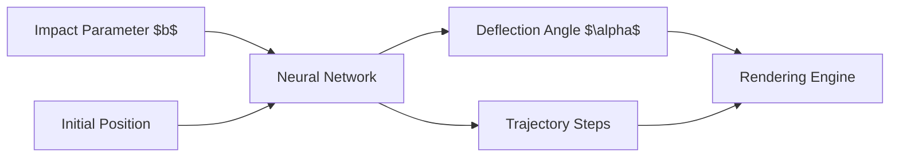

# Neural Geodesics

> **Neural network approximation of geodesic integration in Schwarzschild spacetime for real-time black hole ray tracing.**

Neural Geodesics replaces the computationally expensive numerical integration of null geodesics (photon trajectories) around a Schwarzschild black hole with a highly optimized Physics-Informed Neural Network (PIMLP). This allows for dramatically faster real-time rendering of black holes while maintaining physical accuracy.

## Key Features
- [x] Fast neural approximation of the Binet equation
- [x] Physics-Informed ML architecture (PIMLP)
- [x] Accurate handling of the critical impact parameter (photon sphere)
- [x] Export to ONNX for cross-platform and web inference
- [x] Modular data generation using Runge-Kutta (RK45) ground truth

## Architecture



## Physics: Schwarzschild Geodesics

In the context of General Relativity, a non-rotating black hole is described by the Schwarzschild metric. The trajectory of a photon (null geodesic) is primarily determined by its impact parameter $b = L/E$, where $L$ is the angular momentum and $E$ is the energy.

Using the Binet equation, the radial coordinate $u = 1/r$ as a function of the azimuthal angle $\phi$ follows:
$$\frac{d^2u}{d\phi^2} + u = \frac{3GM}{c^2}u^2$$

## Neural Architecture: PIMLP

We utilize a Physics-Informed Multi-Layer Perceptron (PIMLP). Unlike standard MLPs that purely learn from data, our loss function incorporates the ODE residual from the Binet equation. This hybrid approach ensures that the network not only fits the training data generated by standard integrators but also inherently respects the laws of physics, making it robust even near the unstable photon orbits.

## Quick Start

### Installation
```bash
git clone https://github.com/MaximilianoValderrama/neural-geodesics.git
cd neural-geodesics
pip install -e .
```

### Workflow
1. **Data Generation**: Generate ground truth geodesics using classical RK45 integration.
2. **Training**: Train the PIMLP model using both MSE and physics-informed losses.
3. **Evaluation**: Benchmark the neural approximations against classical integrators.
4. **Rendering**: Use the trained model to raytrace a black hole image.

## Project Structure

```text
neural-geodesics/
├── data/
│   ├── raw/
│   └── processed/
├── models/
│   ├── checkpoints/
│   └── onnx/
├── results/
│   ├── figures/
│   └── benchmarks/
├── scripts/
├── notebooks/
├── docs/
├── tests/
├── README.md
└── pyproject.toml
```

## Results

*Coming soon: Performance benchmarks and rendering examples comparing Classical vs Neural Raytracing.*

## References
- Raissi et al. (2019) - Physics-informed neural networks.
- Lu et al. (2021) - Learning nonlinear operators via DeepONet.
- arXiv:2507.15775 - GravLensX: Neural rendering of gravitational lensing.

## License
MIT License

**Author:** Maximiliano Valderrama
