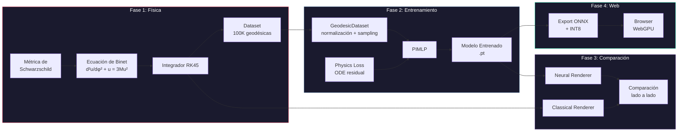
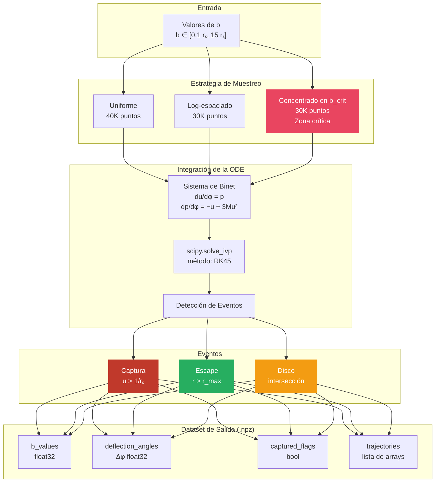
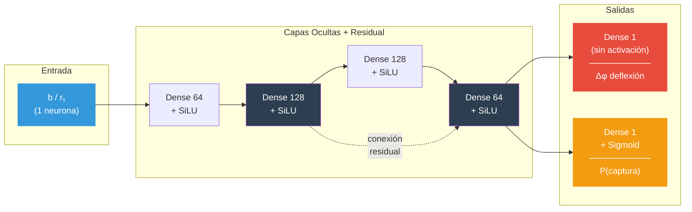
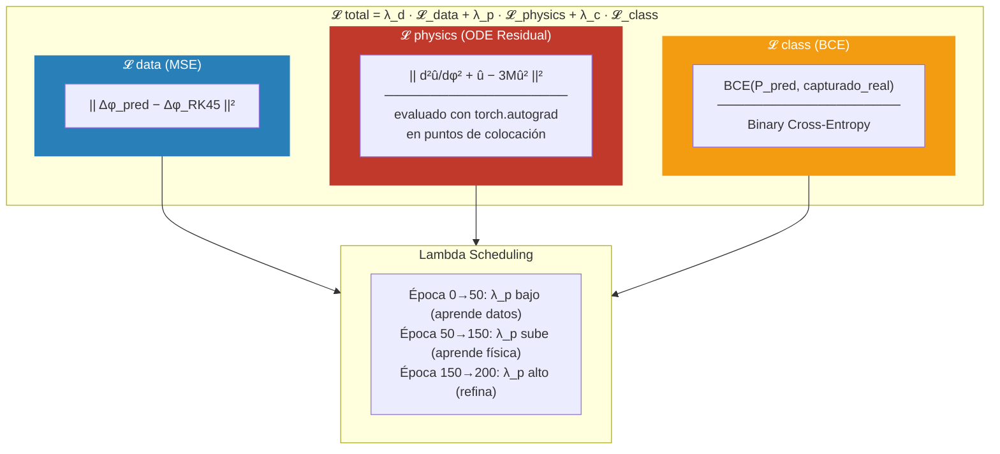
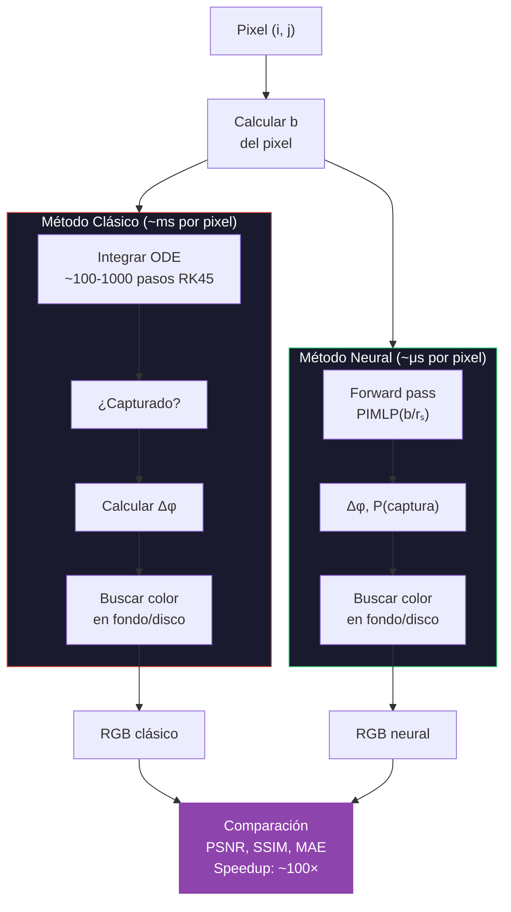
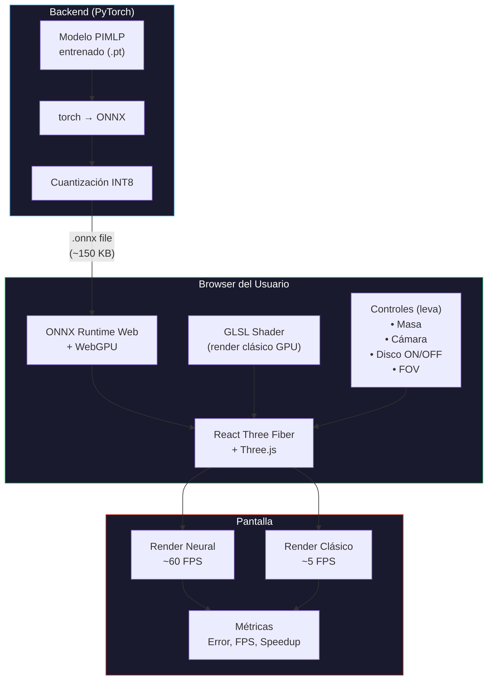
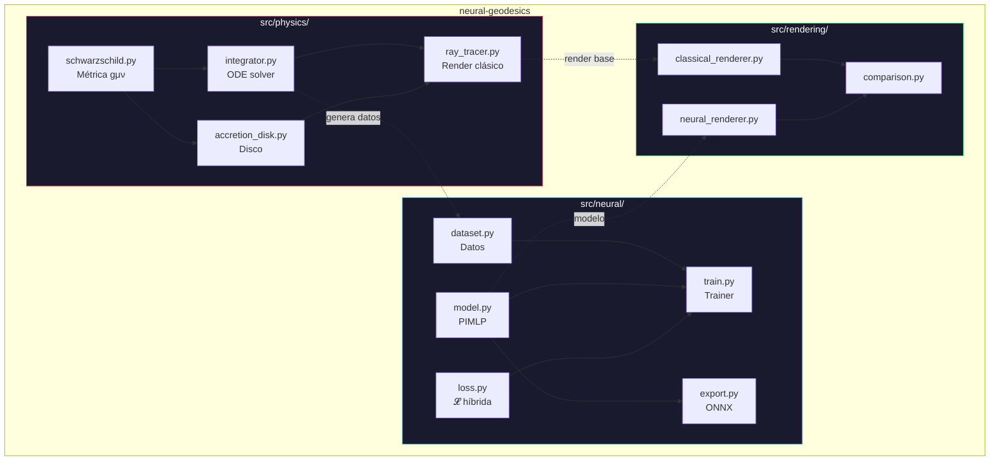

# Neural Geodesics — Arquitectura del Sistema

## 1. Vista General del Pipeline

---

## 2. Generación de Datos (Fase 1 — detalle)

---

## 3. Arquitectura PIMLP (Fase 2 — detalle)

**Total de parámetros**: ~35K (modelo muy ligero -> rápido en browser)

---

## 4. Función de Pérdida Híbrida

> **¿Por qué "Physics-Informed"?** La 𝓛_physics fuerza a la red a respetar la ecuación de Binet. Sin esto, la red podría dar predicciones rápidas pero físicamente incorrectas. Con esto, incluso en zonas con pocos datos de entrenamiento, la red "sabe" la física.

---

## 5. Pipeline de Inferencia — Clásico vs Neural

---

## 6. Despliegue Web (Fase 4)

---

## 7. Estructura de Módulos

